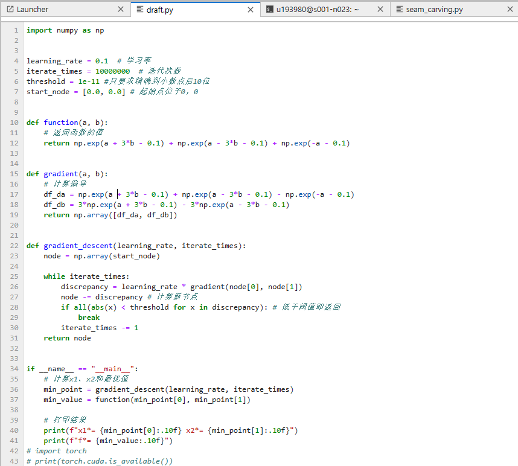

Intel® oneAPI AI Analytics Toolkit（英特尔® oneAPI AI Analytics 工具包）是一套用于数据分析和机器学习的工具包。它提供了针对英特尔® 架构优化的框架和库，可以加速端到端的机器学习和数据分析流程，旨在简化跨多种体系结构的高性能计算应用程序的开发过程。oneAPI的目标是实现性能可移植性，使开发者能够在不同类型的硬件上编写高效的代码。
目标和理念：Intel® oneAPI旨在提供一个统一的编程模型，使开发者能够跨多种架构（如CPU、GPU、FPGA等）编写高性能代码。通过使用统一的API和工具链，开发者可以更轻松地针对不同类型的硬件进行优化，并在不同设备上实现性能可移植性。
oneAPI工具套件：Intel® oneAPI包括多个工具和库，用于支持不同层次和类型的开发任务。其中包括：
Intel® oneAPI Base Toolkit：提供了基本的编程工具和库，如C++编译器、性能分析器、调试器等。
Intel® oneAPI HPC Toolkit：专注于高性能计算领域，提供了优化的数学库、并行化库和调试工具，以支持科学计算和模拟应用的开发。
Intel® oneAPI IoT Toolkit：用于物联网设备开发，包含了用于开发边缘计算和物联网应用的工具和库。
Intel® oneAPI AI Analytics Toolkit：用于数据分析和机器学习的工具套件，提供了优化的机器学习库、数据处理库和深度学习框架的支持。
Intel® oneAPI Rendering Toolkit：专注于图形渲染和可视化领域，提供了用于创建高性能图形应用程序的工具和库。
DPC++编程模型：DPC++（Data Parallel C++）是Intel® oneAPI中的主要编程模型，它是对C++进行扩展，使开发者能够利用并行计算和异构计算资源。DPC++支持使用SYCL（Standard C++ for Heterogeneous Computing）标准来描述并行计算任务，并提供了方便的编程接口来管理设备内核和数据传输。
可移植性和性能优化：Intel® oneAPI提供了一套工具和库，帮助开发者实现代码的性能可移植性，并针对不同的硬件平台进行优化。开发者可以使用性能分析器和调试器来分析和优化代码，利用优化的数学库和算法来提高计算性能，以及利用硬件加速器（如GPU、FPGA）来加速计算密集型任务。
社区支持和生态系统：Intel® oneAPI拥有一个活跃的社区，开发者可以在社区中获取支持、交流经验和分享代码。此外，Intel® oneAPI还与各种开源项目和合作伙伴进行了整合，以支持更广泛的开发者群体。
在工具包中，有一些重要的概念需要了解：

- 人工智能（AI）、机器学习（ML）和深度学习（DL）是三个相关但不同的概念。
- 人工智能是指使计算机系统具备类似人类智能的能力。
- 机器学习是一种人工智能的分支，通过使用数据和算法让计算机系统从经验中学习和改进。
- 深度学习是机器学习的一种特定形式，使用深度神经网络来进行学习和推断。

在机器学习中，有两种主要类型：

1. 监督学习（Supervised Learning）：训练数据包括带有目标标签的样本，模型通过学习输入数据和对应的目标标签之间的关系来进行预测。
2. 无监督学习（Unsupervised Learning）：训练数据没有目标标签，模型通过寻找数据中的结构和模式来进行预测或分类。

在监督学习中，常见的任务包括分类（Classification）和回归（Regression）：

- 分类任务是根据给定的特征预测实体的标签，如垃圾邮件分类、情感分析等。
- 回归任务是根据给定的特征预测实体的实数值，如房价预测、销售量预测等。

在无监督学习中，常见的任务包括聚类（Clustering）和推荐系统（Recommendation）：

- 聚类任务是将具有相似特征的实体进行分组，如市场细分、用户分群等。
- 推荐系统是根据用户的过去行为或偏好向其推荐物品，如基于用户购买历史的产品推荐。

Intel® oneAPI AI Analytics Toolkit还提供了许多用于数据分析和机器学习的Python库和框架，包括NumPy、Scikit-learn、TensorFlow、PyTorch等。这些库经过了针对英特尔® 架构的优化，可以提供更好的性能和效率。

工具包中还包括Intel® oneAPI Data Analytics Library（oneDAL），它提供了针对多核系统的分布式算法和高效的内存优化，可以实现更好的可扩展性和性能。

此外，工具包还包括了Intel® Distribution of Modin，这是一个基于Pandas的高性能数据分析库，可以加速数据预处理和分析的速度。

下面是在jupyter上的一段测试代码，运行结果正常，且能够通过终端配置环境，十分方便。在处理一些大数据时速度比较快

